# Turn it over

A travel journal built like a box of photographs. Every photo on the site is a print you can pick up
and turn over — the story of that day is written on the back.

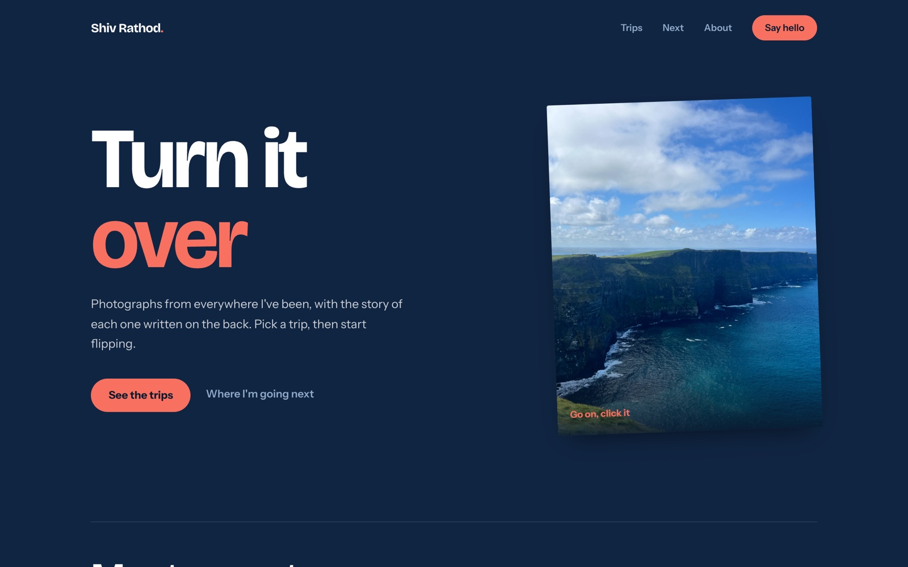

Built with **Next.js 16**, **React 18**, **MUI 5**, **Framer Motion** and **Leaflet**. No CMS, no
database — the trips are plain JavaScript data, and the whole thing is static enough to deploy
anywhere Node runs.

```bash
npm install
npm run dev     # http://localhost:3000
```

---

## The idea

I'm a software engineer who spends every hour of PTO on a plane, and I kept losing the details of
where I'd been. So instead of a blog with walls of text, the site is the shoebox: a grid of prints,
and the writing hidden on the back of each one. Nothing is behind a "read more" link — you click the
photograph itself.

| | |
|---|---|
| 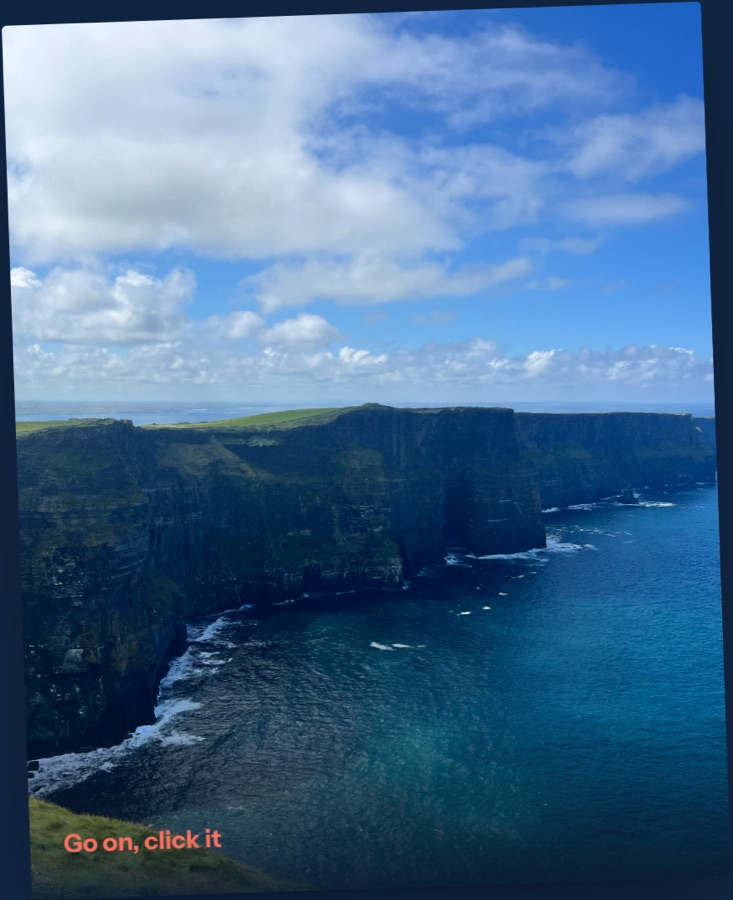 | 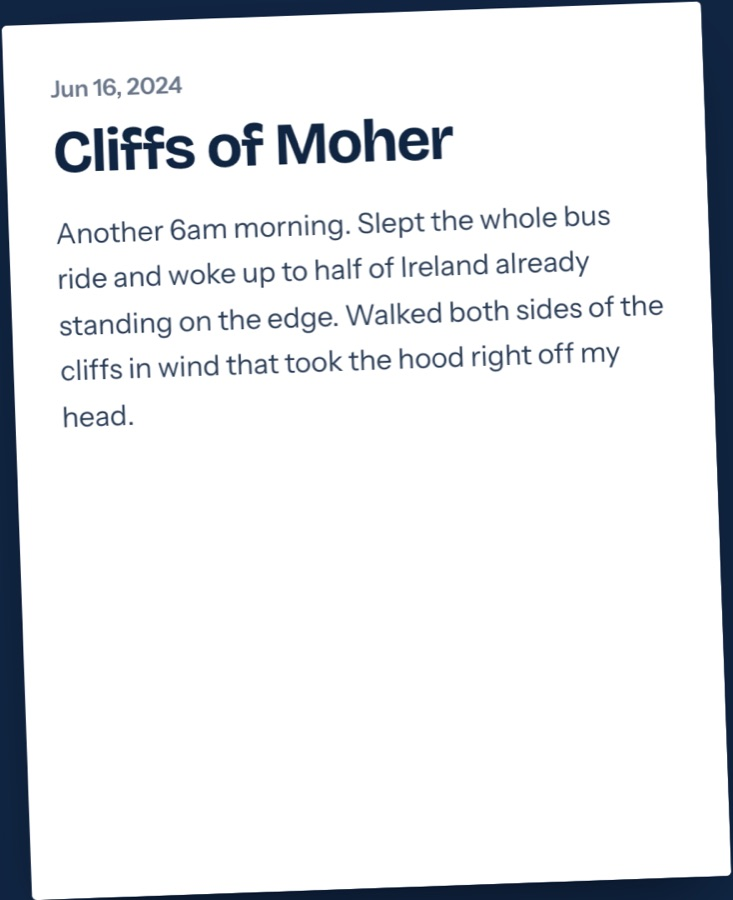 |
| The print on the home page… | …and the back of it, one click later. |

The home page keeps it to the hero print and the two most recent trips — the archive is one click
away, so the front door stays a front door.

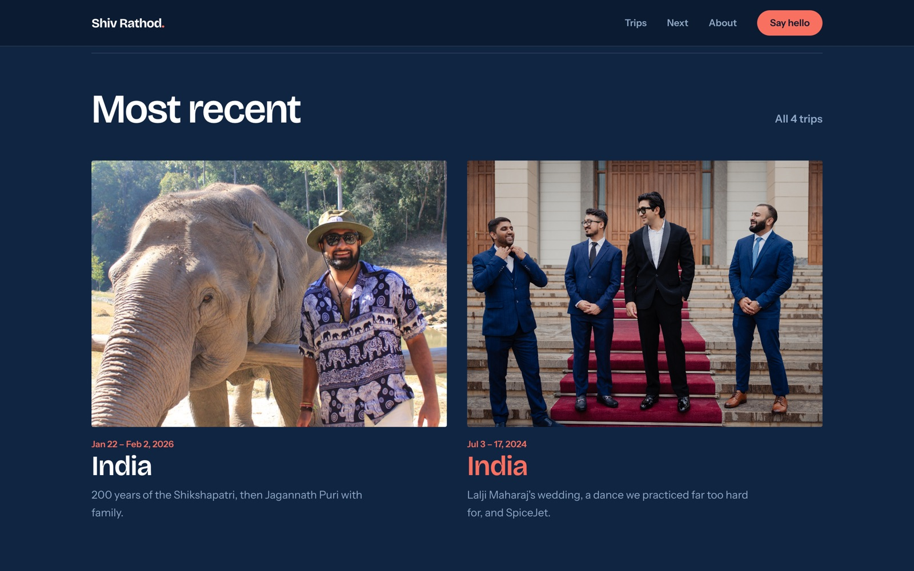

---

## Features

### The flip

Every photograph is a two-sided card: the image on the front, and the date, place, day and note on
the back. On a trip page you can leave as many turned over as you like, so a note sits in the grid
next to the photos it belongs with.

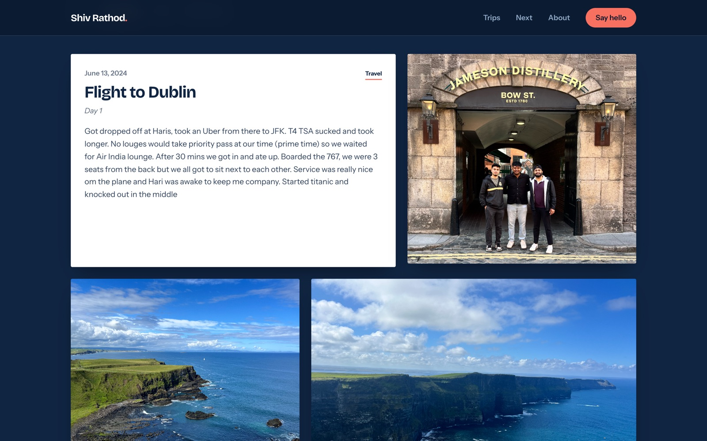

Under the hood ([`components/FlipPrint.js`](components/FlipPrint.js)) each print is a single
`<button>` with `transform-style: preserve-3d` and two `backface-visibility: hidden` faces. It
carries `aria-pressed` and a label that changes with the state ("Read the note on Cliffs of
Moher" / "Hide the note on…"), so it works with a keyboard and a screen reader. When the visitor has
asked for reduced motion the card turns over instantly instead of animating.

### The photo wall

A trip page is nothing but its photographs, laid out in a 12-column grid on a repeating
`[7, 5, 5, 7, 12]` span pattern. Each card's aspect ratio is derived from its span, so every row
lands flush no matter how many photos a trip has, while the prints themselves keep changing shape.

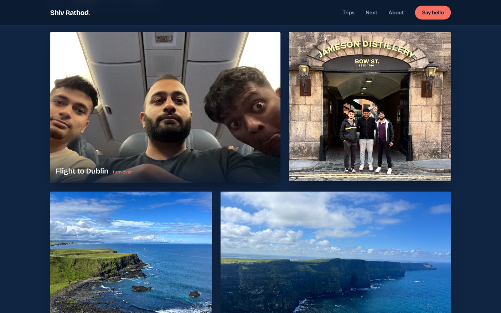

Cards fade and un-rotate as they scroll into view, images are lazy-loaded, and a photo that fails to
load falls back to a striped card that still carries its note
([`components/PhotoWall.js`](components/PhotoWall.js)).

### Filter by what you came to see

The category chips aren't hard-coded — they're derived from whatever categories that trip's data
actually contains, and more than one can be active at a time. The wall re-lays itself out around the
selection.

| | |
|---|---|
| 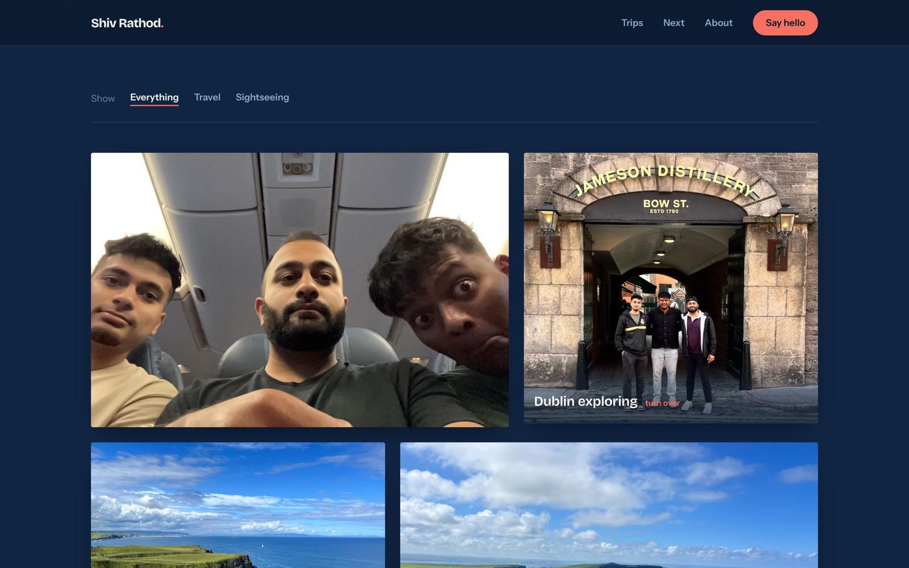 | 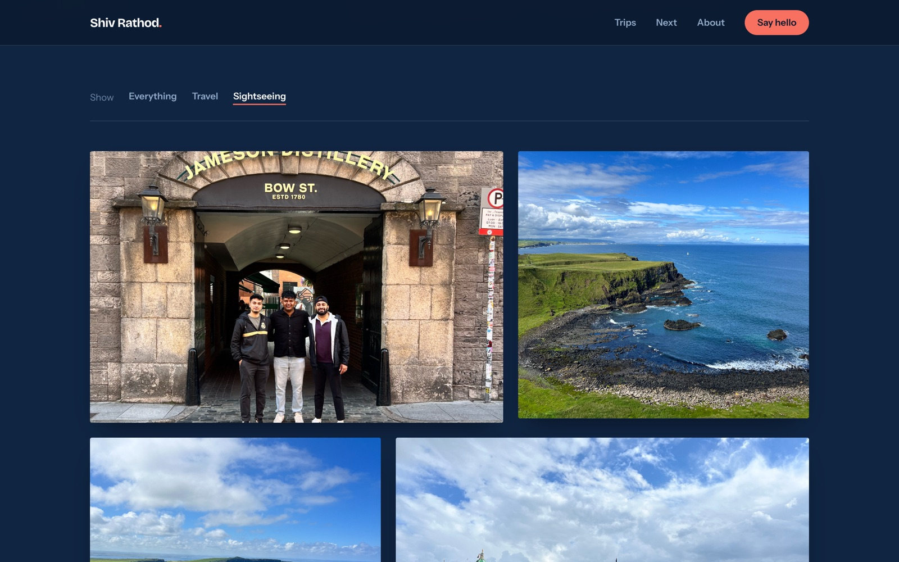 |
| Everything. | Just the sightseeing. |

### Every trip, and a search that filters as you type

The archive lists each trip alternating left and right, with its dates, region, photo count and how
many of us went. The search box filters across title, region, dates and blurb on every keystroke,
and has a real empty state when nothing matches.

| | |
|---|---|
| 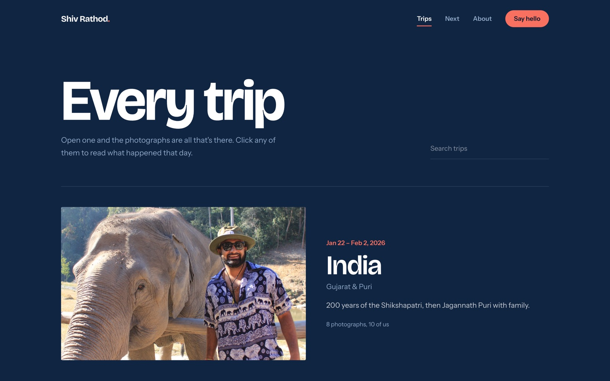 | 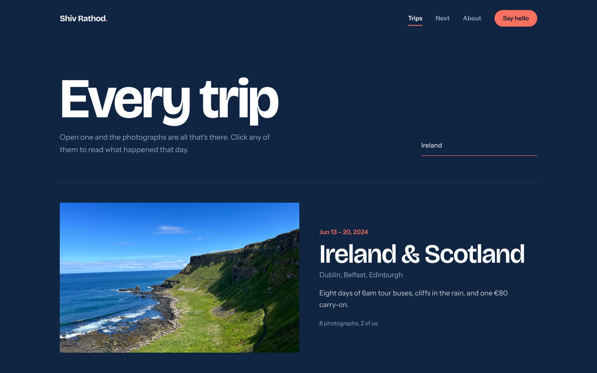 |

### Where the photos were taken

Trips whose photos carry coordinates get a map at the bottom of the page: a dark Esri basemap, a
coral marker per stop, popups with the place and date, and bounds fitted to whatever is currently
visible — so filtering the wall re-frames the map too.

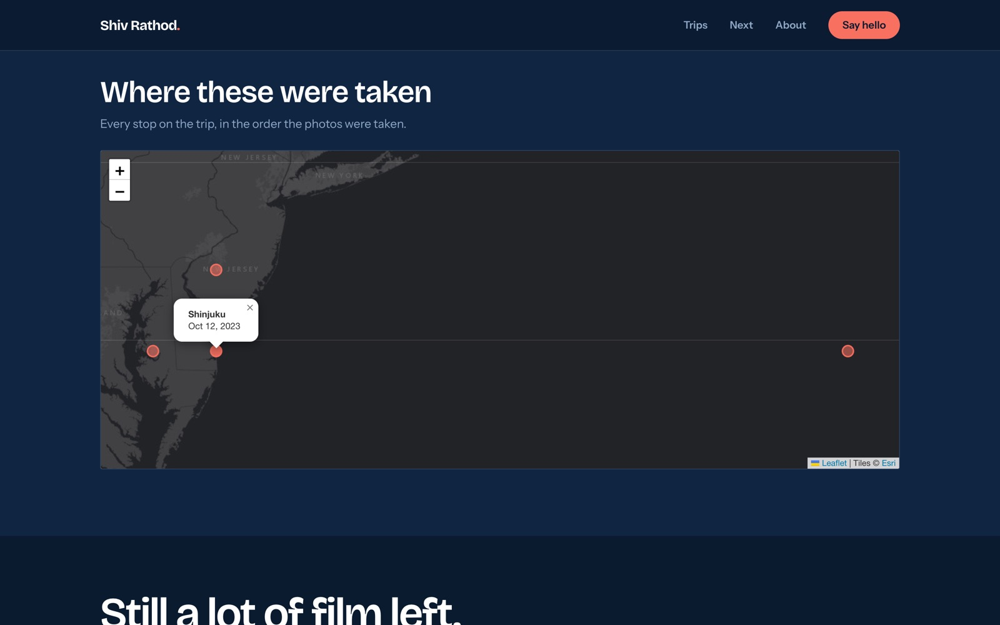

Leaflet can't run on the server, so the map is pulled in with `next/dynamic` and `ssr: false`
([`components/TripMap.js`](components/TripMap.js)).

### A trip hero that tells you what you're looking at

Dates, title, blurb, the faces of everyone who came along, and how many photographs are waiting
below — over a slow Ken Burns push on the cover image.

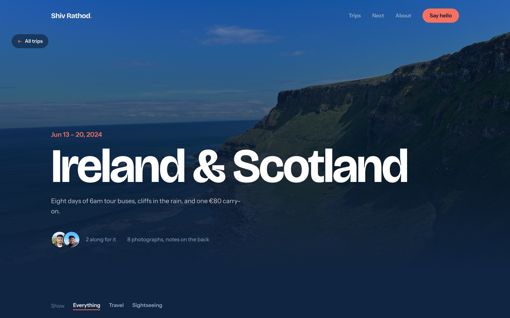

### The entrance

The first page you open in a browser session lifts a curtain: the name, a coral hairline drawn
underneath it, then the whole panel slides off the top of the screen.

| | |
|---|---|
|  | 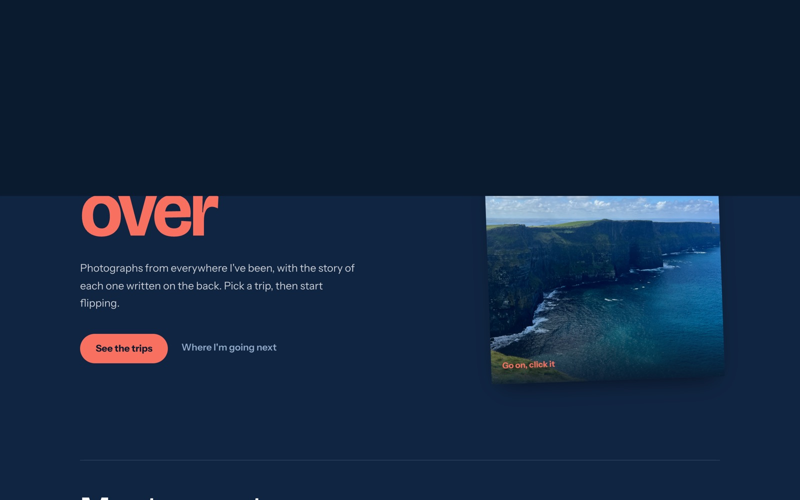 |

It's CSS with `animation-fill-mode: forwards`, so the curtain ends lifted even if its React timer
never fires. It shows once per session (`sessionStorage`), never when the visitor prefers reduced
motion, and it falls back to showing rather than breaking in private browsing
([`components/Intro.js`](components/Intro.js)).

### About, and where I'm going next

| | |
|---|---|
| 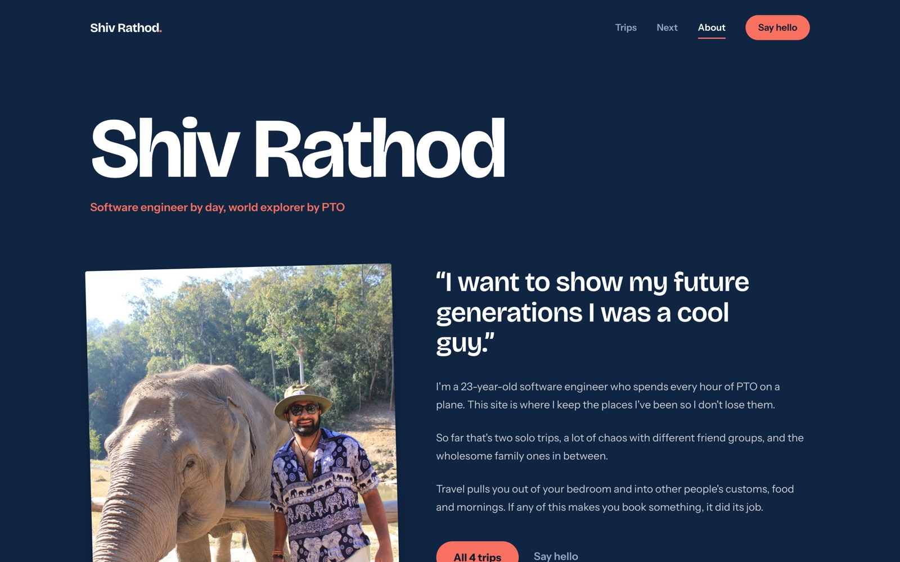 |  |
| Who's behind it. | Eight places with no photographs yet — the point of the page. |

### It works on a phone

The grid collapses to one column, the nav becomes a drawer, and the flip hints that appear on hover
on a desktop are always visible on touch, where there is no hover to give them away.

| | |
|---|---|
| 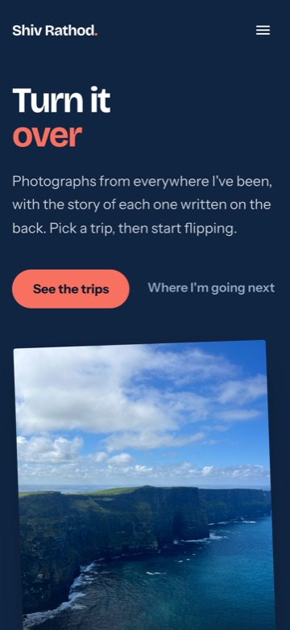 | 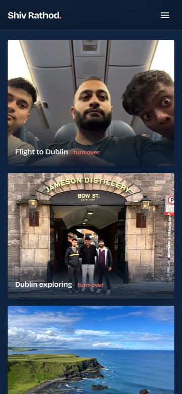 |

---

## How it's put together

**One source of truth per thing.** [`trips.js`](trips.js) holds the trip list — title, dates, region,
cover, travelers — and the home page, the archive and every trip page read from it, so they can't
drift apart. [`travelersData.js`](travelersData.js) holds the people, [`tripData.js`](tripData.js)
the day-by-day photos and notes.

**Two data shapes, one renderer.** Older trips are a flat list of days; newer ones nest an
`activities` array inside each day. [`tripUtils.js`](tripUtils.js) collapses both into the same flat
run of photographs — each carrying its day, date, place, category, coordinates and note — so
`TripPage` only ever sees one shape, and adding a trip is adding data, not a component.

**Design tokens, not magic numbers.** The palette (navy ground, white paper, coral accent), the two
typefaces and the type scale live once in [`styles/theme.js`](styles/theme.js) and mirrored CSS
variables in [`styles/global.css`](styles/global.css). Headings use a `clamp()` scale, so the display
type sizes itself against the viewport instead of breaking at a handful of fixed steps.

**Motion that asks first.** Every animation goes through Framer Motion's `useReducedMotion`, or a
`matchMedia` check in the case of the intro. With reduced motion on, the site renders in its final
state instead of animating into it.

```
components/     FlipPrint, PhotoWall, TripFilter, TripMap, TripHero, TripPage, Navbar, Footer, Intro
pages/          index, pasttrips, futuretrips, about, and one page per trip
trips.js        the trip list — the single source of truth
tripData.js     day-by-day photographs and the notes on their backs
tripUtils.js    normalizes both trip data shapes into one flat list of photographs
styles/         MUI theme + CSS variables for the same tokens
public/images/  the photographs
docs/           the screenshots in this README
```

---

## Running it

```bash
npm install
npm run dev       # dev server on http://localhost:3000
npm run build     # production build
npm start         # serve the production build
```

Node 20+ (Next.js 16). No environment variables, no services to stand up.

---

© Shiv Rathod · [LinkedIn](https://www.linkedin.com/in/shivrathod/) · [shivr12400@gmail.com](mailto:shivr12400@gmail.com)
